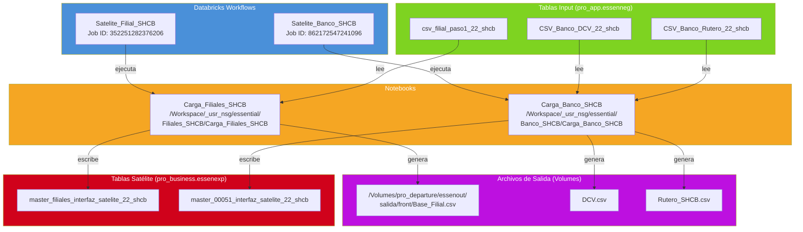
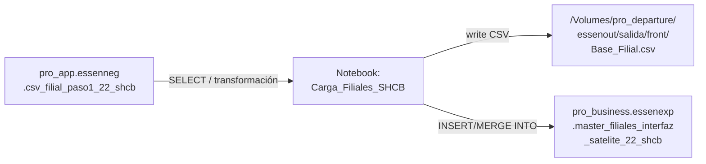
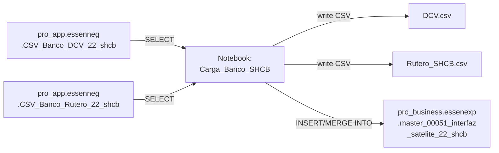
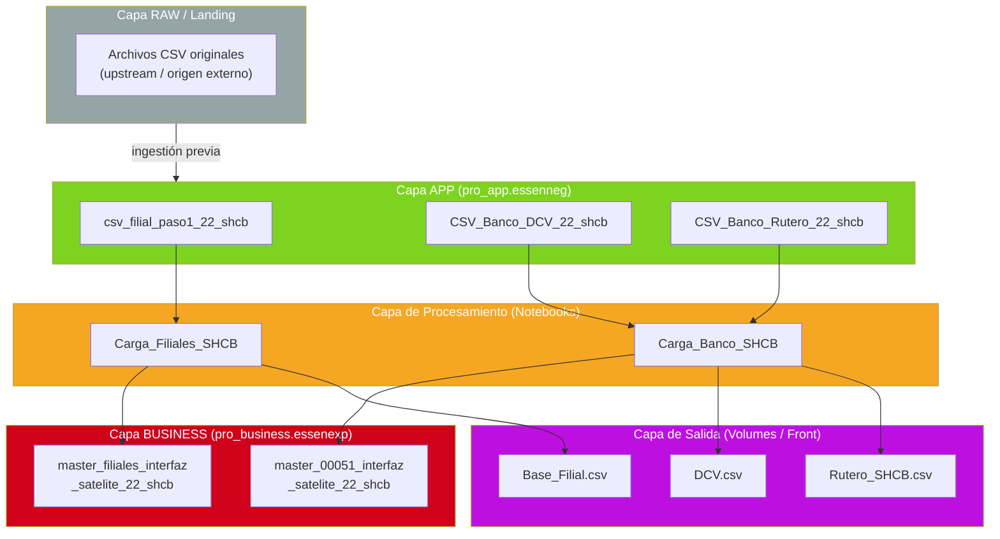
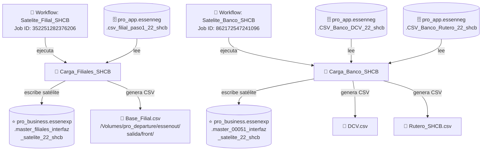

# Documentación Técnica — Master y Satélites Filial y Banco (SHCB)

> **Área:** Essential  
> **PO:** Felipe Araya  
> **Ticket:** J00121-5821 — ESSEN-Migración del proceso de generación de satélite SHCB  
> **Fecha de documentación:** 2026-06-05

---

## 1. Resumen Ejecutivo

El proceso **Master y Satélites Filial y Banco (SHCB)** es un pipeline de datos del área Essential que genera archivos satélite a partir de tablas intermedias en Databricks. Se divide en dos flujos independientes:

| Flujo | Propósito |
|-------|-----------|
| **Filial** | Genera el archivo `Base_Filial.csv` y lo publica en la tabla satélite de filiales. |
| **Banco** | Genera los archivos `DCV.csv` y `Rutero_SHCB.csv` y los publica en la tabla satélite del banco (master 00051). |

Ambos flujos se ejecutan como **Databricks Workflows** programados, leen tablas del catálogo `pro_app.essenneg` y escriben en tablas del catálogo `pro_business.essenexp`.

---

## 2. Arquitectura del Flujo

### 2.1 Diagrama General de Arquitectura

```
┌─────────────────────────────────────────────────────────────────────┐
│                      DATABRICKS WORKSPACE                           │
│                                                                     │
│  ┌───────────────────────┐       ┌───────────────────────┐         │
│  │   WORKFLOW: Filial    │       │   WORKFLOW: Banco     │         │
│  │   Job 352251282376206 │       │   Job 862172547241096 │         │
│  │   Satelite_Filial_SHCB│       │   Satelite_Banco_SHCB │         │
│  └──────────┬────────────┘       └──────────┬────────────┘         │
│             │                               │                       │
│             ▼                               ▼                       │
│  ┌──────────────────────┐       ┌──────────────────────────┐       │
│  │ NOTEBOOK:            │       │ NOTEBOOK:                │       │
│  │ Carga_Filiales_SHCB  │       │ Carga_Banco_SHCB        │       │
│  └──────────┬───────────┘       └──────────┬───────────────┘       │
│             │                               │                       │
│     ┌───────┴───────┐              ┌────────┴────────┐             │
│     │    INPUT      │              │     INPUT       │             │
│     │               │              │                 │             │
│     ▼               ▼              ▼                 ▼             │
│  ┌────────┐  ┌───────────┐  ┌──────────┐  ┌────────────────┐     │
│  │csv_    │  │Base_Filial│  │CSV_Banco_│  │CSV_Banco_      │     │
│  │filial_ │  │.csv       │  │DCV_22_   │  │Rutero_22_shcb  │     │
│  │paso1_  │  │(output)   │  │shcb      │  │                │     │
│  │22_shcb │  │           │  │          │  │                │     │
│  └────┬───┘  └───────────┘  └────┬─────┘  └───────┬────────┘     │
│       │                          │                 │               │
│       ▼                          └────────┬────────┘               │
│  ┌─────────────────────┐                  ▼                        │
│  │ SATÉLITE FILIAL     │     ┌──────────────────────┐             │
│  │ master_filiales_    │     │ SATÉLITE BANCO       │             │
│  │ interfaz_satelite_  │     │ master_00051_        │             │
│  │ 22_shcb             │     │ interfaz_satelite_   │             │
│  └─────────────────────┘     │ 22_shcb              │             │
│                              └──────────────────────┘             │
└─────────────────────────────────────────────────────────────────────┘
```

### 2.2 Diagrama de Dependencias (Mermaid)



---

## 3. Inventario de Componentes

### 3.1 Workflows (Databricks Jobs)

| Nombre del Job | Job ID | Notebook Asociado | Flujo |
|----------------|--------|-------------------|-------|
| `Satelite_Filial_SHCB` | `352251282376206` | `Carga_Filiales_SHCB` | Filial |
| `Satelite_Banco_SHCB` | `862172547241096` | `Carga_Banco_SHCB` | Banco |

### 3.2 Notebooks

| Notebook | Ruta en Workspace | Flujo |
|----------|-------------------|-------|
| `Carga_Filiales_SHCB` | `/Workspace/_usr_nsg/essential/Filiales_SHCB/Carga_Filiales_SHCB` | Filial |
| `Carga_Banco_SHCB` | `/Workspace/_usr_nsg/essential/Banco_SHCB/Carga_Banco_SHCB` | Banco |

### 3.3 Tablas Input

| Tabla (FQN) | Catálogo | Schema | Tabla | Flujo |
|-------------|----------|--------|-------|-------|
| `pro_app.essenneg.csv_filial_paso1_22_shcb` | `pro_app` | `essenneg` | `csv_filial_paso1_22_shcb` | Filial |
| `pro_app.essenneg.CSV_Banco_DCV_22_shcb` | `pro_app` | `essenneg` | `CSV_Banco_DCV_22_shcb` | Banco |
| `pro_app.essenneg.CSV_Banco_Rutero_22_shcb` | `pro_app` | `essenneg` | `CSV_Banco_Rutero_22_shcb` | Banco |

### 3.4 Tablas Satélite (Output)

| Tabla (FQN) | Catálogo | Schema | Tabla | Flujo |
|-------------|----------|--------|-------|-------|
| `pro_business.essenexp.master_filiales_interfaz_satelite_22_shcb` | `pro_business` | `essenexp` | `master_filiales_interfaz_satelite_22_shcb` | Filial |
| `pro_business.essenexp.master_00051_interfaz_satelite_22_shcb` | `pro_business` | `essenexp` | `master_00051_interfaz_satelite_22_shcb` | Banco |

### 3.5 Archivos Generados (Unity Catalog Volumes)

| Archivo | Ruta | Flujo |
|---------|------|-------|
| `Base_Filial.csv` | `/Volumes/pro_departure/essenout/salida/front/Base_Filial.csv` | Filial |
| `DCV.csv` | *(ruta por confirmar — generado por notebook Banco)* | Banco |
| `Rutero_SHCB.csv` | *(ruta por confirmar — generado por notebook Banco)* | Banco |

---

## 4. Detalle del Flujo — Filial

### 4.1 Pipeline de Datos



### 4.2 Descripción del Proceso

1. **Trigger**: El workflow `Satelite_Filial_SHCB` (Job ID `352251282376206`) se ejecuta según su schedule configurado en Databricks.
2. **Lectura**: El notebook `Carga_Filiales_SHCB` lee la tabla de paso `pro_app.essenneg.csv_filial_paso1_22_shcb`, que contiene datos previamente cargados de filiales.
3. **Transformación**: El notebook aplica las transformaciones de negocio necesarias para generar el formato de interfaz satélite.
4. **Escritura de archivo CSV**: Se genera el archivo `Base_Filial.csv` en la ruta `/Volumes/pro_departure/essenout/salida/front/`, que es consumido por sistemas downstream (front).
5. **Escritura en tabla satélite**: Los datos transformados se escriben en la tabla `pro_business.essenexp.master_filiales_interfaz_satelite_22_shcb`, que sirve como la interfaz satélite oficial de filiales.

### 4.3 Mapeo de Datos — Filial

| Origen | Destino | Tipo de Operación |
|--------|---------|-------------------|
| `pro_app.essenneg.csv_filial_paso1_22_shcb` | Notebook `Carga_Filiales_SHCB` | Lectura (Spark SQL / DataFrame) |
| Notebook `Carga_Filiales_SHCB` | `/Volumes/.../Base_Filial.csv` | Escritura CSV a Volume |
| Notebook `Carga_Filiales_SHCB` | `pro_business.essenexp.master_filiales_interfaz_satelite_22_shcb` | Escritura a tabla Unity Catalog |

---

## 5. Detalle del Flujo — Banco

### 5.1 Pipeline de Datos



### 5.2 Descripción del Proceso

1. **Trigger**: El workflow `Satelite_Banco_SHCB` (Job ID `862172547241096`) se ejecuta según su schedule configurado en Databricks.
2. **Lectura**: El notebook `Carga_Banco_SHCB` lee dos tablas de paso:
   - `pro_app.essenneg.CSV_Banco_DCV_22_shcb` — datos de DCV (Depósito Central de Valores).
   - `pro_app.essenneg.CSV_Banco_Rutero_22_shcb` — datos del rutero SHCB.
3. **Transformación**: El notebook aplica las transformaciones requeridas para generar los formatos de interfaz.
4. **Escritura de archivos CSV**:
   - `DCV.csv` — archivo con datos del Depósito Central de Valores.
   - `Rutero_SHCB.csv` — archivo con datos del rutero.
5. **Escritura en tabla satélite**: Los datos consolidados se escriben en la tabla `pro_business.essenexp.master_00051_interfaz_satelite_22_shcb` (master 00051), que es la interfaz satélite oficial del banco.

### 5.3 Mapeo de Datos — Banco

| Origen | Destino | Tipo de Operación |
|--------|---------|-------------------|
| `pro_app.essenneg.CSV_Banco_DCV_22_shcb` | Notebook `Carga_Banco_SHCB` | Lectura (Spark SQL / DataFrame) |
| `pro_app.essenneg.CSV_Banco_Rutero_22_shcb` | Notebook `Carga_Banco_SHCB` | Lectura (Spark SQL / DataFrame) |
| Notebook `Carga_Banco_SHCB` | `DCV.csv` | Escritura CSV |
| Notebook `Carga_Banco_SHCB` | `Rutero_SHCB.csv` | Escritura CSV |
| Notebook `Carga_Banco_SHCB` | `pro_business.essenexp.master_00051_interfaz_satelite_22_shcb` | Escritura a tabla Unity Catalog |

---

## 6. Modelo de Capas de Datos

El proceso sigue un modelo de capas estándar en Databricks con Unity Catalog:



### Convención de Nombrado de Tablas

El sufijo `_22_shcb` indica:
- `22`: Código identificador del proceso dentro del área Essential.
- `shcb`: Identificador del sistema origen/destino (Santander Holdings Chile Banco).

### Catálogos Unity Catalog

| Catálogo | Propósito | Ejemplo |
|----------|-----------|---------|
| `pro_app` | Tablas intermedias / de aplicación (paso) | `essenneg.csv_filial_paso1_22_shcb` |
| `pro_business` | Tablas de negocio / interfaces satélite (output final) | `essenexp.master_filiales_interfaz_satelite_22_shcb` |
| `pro_departure` | Volumes para archivos de salida (CSV) | `/Volumes/pro_departure/essenout/salida/front/` |

### Schemas

| Schema | Catálogo | Propósito |
|--------|----------|-----------|
| `essenneg` | `pro_app` | Tablas de negocio Essential (input / staging) |
| `essenexp` | `pro_business` | Tablas de exportación Essential (satélites / interfaces) |
| `essenout` | `pro_departure` | Volúmenes de salida Essential |

---

## 7. Diagrama de Dependencias Completo



---

## 8. Resumen de Mapeo de Datos End-to-End

### 8.1 Flujo Filial — Completo

```
[FUENTE UPSTREAM]
       │
       ▼ (ingestión previa)
pro_app.essenneg.csv_filial_paso1_22_shcb
       │
       ▼ (Notebook: Carga_Filiales_SHCB)
       ├──► /Volumes/pro_departure/essenout/salida/front/Base_Filial.csv
       └──► pro_business.essenexp.master_filiales_interfaz_satelite_22_shcb
```

### 8.2 Flujo Banco — Completo

```
[FUENTE UPSTREAM]
       │
       ▼ (ingestión previa)
pro_app.essenneg.CSV_Banco_DCV_22_shcb ──┐
pro_app.essenneg.CSV_Banco_Rutero_22_shcb ┘
       │
       ▼ (Notebook: Carga_Banco_SHCB)
       ├──► DCV.csv
       ├──► Rutero_SHCB.csv
       └──► pro_business.essenexp.master_00051_interfaz_satelite_22_shcb
```

---

## 9. Consideraciones Técnicas

### 9.1 Entorno de Ejecución

- **Plataforma**: Databricks Workspace con Unity Catalog.
- **Motor de procesamiento**: Apache Spark (a través de notebooks Databricks).
- **Orquestación**: Databricks Workflows (Jobs).
- **Almacenamiento de archivos**: Unity Catalog Volumes (`/Volumes/pro_departure/...`).

### 9.2 Dependencias Operacionales

| Dependencia | Descripción |
|-------------|-------------|
| Tablas de paso en `pro_app.essenneg` | Deben estar pobladas antes de la ejecución de los workflows. |
| Permisos Unity Catalog | Los notebooks requieren permisos de lectura en `pro_app` y escritura en `pro_business` y `pro_departure`. |
| Schedule de los workflows | Los jobs deben estar correctamente programados en Databricks. |
| Upstream processes | Los procesos que pueblan las tablas `csv_filial_paso1_22_shcb`, `CSV_Banco_DCV_22_shcb` y `CSV_Banco_Rutero_22_shcb` deben completarse exitosamente antes. |

### 9.3 Nomenclatura de Tablas Master/Satélite

- **Master**: Tabla principal de referencia del proceso Essential.
- **Satélite**: Tabla derivada que contiene un subconjunto o transformación de la data del master, formateada como interfaz para consumo de otros sistemas.
- **Interfaz**: Indica que la tabla es un punto de integración con sistemas externos.

### 9.4 Puntos de Atención para Migración (Ticket J00121-5821)

1. **Validar que las tablas de paso** (`csv_filial_paso1_22_shcb`, `CSV_Banco_DCV_22_shcb`, `CSV_Banco_Rutero_22_shcb`) mantengan la misma estructura (schema) tras la migración.
2. **Verificar rutas de salida** de los archivos CSV, especialmente la ruta del Volume `/Volumes/pro_departure/essenout/salida/front/`.
3. **Confirmar los Job IDs** post-migración, ya que podrían cambiar si se recrean los workflows.
4. **Testear** que los archivos CSV generados mantienen el mismo formato (delimitador, encoding, headers).
5. **Validar permisos** en Unity Catalog para los catálogos `pro_app`, `pro_business`, `pro_departure`.

---

## 10. Glosario

| Término | Definición |
|---------|------------|
| **SHCB** | Santander Holdings Chile Banco — sistema corporativo. |
| **Essential** | Área de negocio dentro de Santander que gestiona procesos de datos core. |
| **Master** | Tabla principal de referencia con datos consolidados. |
| **Satélite** | Tabla derivada del master con datos específicos para una interfaz. |
| **Unity Catalog** | Sistema de gobierno de datos de Databricks con catálogos, schemas y tablas. |
| **Volume** | Almacenamiento de archivos gestionado por Unity Catalog en Databricks. |
| **DCV** | Depósito Central de Valores — entidad financiera. |
| **Rutero** | Tabla/archivo de ruteo que define mapeos o direccionamientos de datos. |
| **Workflow / Job** | Tarea programada en Databricks que ejecuta uno o más notebooks. |
| **Notebook** | Código ejecutable en Databricks (Python/SQL/Scala). |
| **pro_app** | Catálogo Unity Catalog para tablas intermedias de aplicación. |
| **pro_business** | Catálogo Unity Catalog para tablas de negocio (output final). |
| **pro_departure** | Catálogo Unity Catalog para volúmenes de archivos de salida. |

---

## 11. Contacto y Referencias

| Rol | Persona |
|-----|---------|
| Product Owner | Felipe Araya |

| Referencia | Enlace / Ubicación |
|------------|---------------------|
| Ticket Jira | J00121-5821 |
| Notebook Filial | `/Workspace/_usr_nsg/essential/Filiales_SHCB/Carga_Filiales_SHCB` |
| Notebook Banco | `/Workspace/_usr_nsg/essential/Banco_SHCB/Carga_Banco_SHCB` |
| Job Filial | Databricks Workflow ID `352251282376206` |
| Job Banco | Databricks Workflow ID `862172547241096` |
